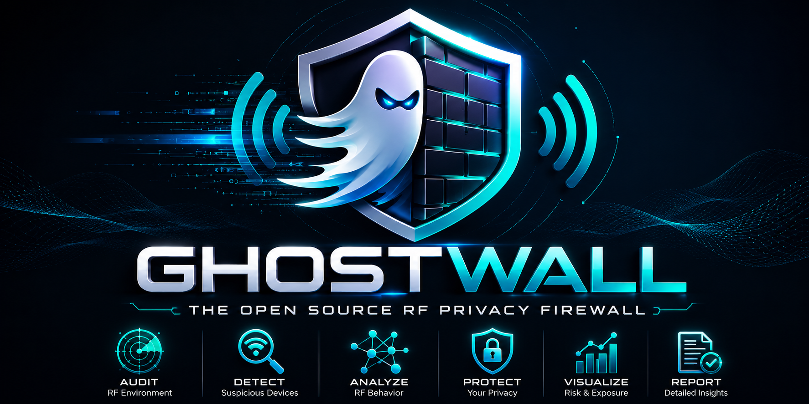

<div align="center">



# GhostWall

### Open Source RF Privacy Firewall

**Visibility • Auditing • Exposure Assessment for RF Sensing Environments**

[](LICENSE)
[]()
[]()
[]()
[]()
[]()

### Understanding RF Exposure Through Visibility, Research and Privacy

</div>

---

# Overview

GhostWall is an Open Source RF Privacy Firewall focused on auditing, visibility and exposure assessment of environments that may be compatible with modern RF sensing technologies.

The project helps researchers, privacy advocates, network administrators and security professionals understand their wireless environment through:

- RF infrastructure discovery
- Device inventory
- Exposure assessment
- Risk scoring
- RF sensing indicators
- Threat intelligence
- Technical reporting

GhostWall is designed using a **privacy-first** approach where processing occurs locally whenever possible.

---

# Why GhostWall?

Recent advances in wireless sensing research have demonstrated that radio signals can be used to infer environmental conditions through techniques such as:

- Wi-Fi Sensing
- Channel State Information (CSI)
- Device-Free Sensing
- RF Fingerprinting
- Radio Tomographic Imaging

GhostWall provides transparency and visibility into RF environments by identifying indicators associated with infrastructures that may be compatible with these technologies.

The goal is awareness, auditing and exposure assessment.

---

# Project Status

⚠️ **Experimental Research Project**

GhostWall is currently under active development.

Features, scoring algorithms and detection methodologies may evolve as research advances.

| Component | Status |
|------------|---------|
| Dashboard | ✅ Implemented |
| REST API | ✅ Implemented |
| Device Inventory | ✅ Implemented |
| RSIE Engine | ✅ Implemented |
| Exposure Assessment | ✅ Implemented |
| Reporting Engine | ✅ Implemented |
| Threat Intelligence | 🚧 In Progress |
| RF Fingerprinting | 🚧 In Progress |
| OpenWRT Agent | 📋 Planned |
| Community Signatures | 📋 Planned |
| Mobile Application | 📋 Planned |

---

# Core Principles

## Visibility

Understand what RF-capable devices exist within an environment.

## Transparency

Provide evidence-based analysis instead of assumptions.

## Privacy

Keep data processing local by default.

## Research

Advance RF privacy awareness through open-source collaboration.

---

# What GhostWall Does

## RF Discovery Engine

Discovers and inventories wireless infrastructure.

Examples:

- Access Points
- Wireless Clients
- ESP32 Devices
- Raspberry Pi Systems
- Broadcom-Based Hardware
- RF Infrastructure Components

Collected information may include:

- MAC Address
- Vendor
- SSID
- BSSID
- RSSI
- Channel
- Security Type
- Device Type
- Activity Status

---

## RF Fingerprinting Engine

Behavioral analysis of wireless devices.

Capabilities include:

- Beacon Analysis
- Channel Utilization
- RSSI Stability
- Broadcast Frequency
- Probe Request Analysis

The objective is to generate behavioral fingerprints that support risk evaluation.

---

## RSIE Engine

### RF Sensing Indicators of Exposure

GhostWall evaluates indicators associated with infrastructures commonly observed in RF sensing research.

Current baseline indicators include:

| Rule | Description |
|--------|------------|
| GW-RF-001 | CSI-compatible hardware detected |
| GW-RF-002 | Multiple compatible devices present |
| GW-RF-003 | Continuous operational profile |
| GW-RF-004 | High-frequency UDP telemetry |
| GW-RF-005 | MQTT telemetry patterns |
| GW-RF-010 | Potential sensing cluster characteristics |
| GW-FP-001 | False-positive reduction |

These indicators contribute to overall risk assessment.

---

## RF Exposure Scanner

Calculates environmental exposure metrics.

Examples:

- Wi-Fi Coverage Density
- Access Point Concentration
- RF Density
- Device Distribution
- Spatial Exposure Factors

Output:

```text
RF Exposure Score
0 - 100
```

---

## Device Inventory

Centralized inventory of observed infrastructure.

Tracks:

- Device Identity
- Hardware Type
- Risk Indicators
- Exposure Factors
- Operational Characteristics

---

## Threat Intelligence

Local and community-driven RF signature database.

Supports:

- Signature Versioning
- Vendor Identification
- Risk Classification
- JSON Import/Export
- Community Research Contributions

---

## Reporting Engine

Generate professional reports in:

- JSON
- HTML
- PDF (planned)

Reports include:

- Device Inventory
- Risk Scores
- Exposure Scores
- Indicators
- Recommendations

---

# Architecture

```text
Scanner Layer
      │
      ▼
Storage Layer
      │
      ▼
Risk Engine
      │
      ├── Threat Intelligence
      ├── Exposure Scanner
      └── Reporting Engine
                │
                ▼
              REST API
                │
                ▼
      Desktop & Mobile Clients
```

For detailed architecture:

📖 See: `ARCHITECTURE.md`

---

# Technology Stack

## Backend

- Rust
- Axum
- Tokio

## Desktop

- Tauri
- React
- TypeScript

## Mobile

- Flutter

## Database

- SQLite

## Containerization

- Docker

## Security

- AES-256-GCM
- Ed25519
- SHA-256
- TLS 1.3

---

# REST API

GhostWall provides a REST API for integrations and automation.

Available endpoints:

```http
GET    /api/health
POST   /api/scan
GET    /api/devices
GET    /api/devices/:id
POST   /api/risk/evaluate
GET    /api/exposure
GET    /api/threat-intel
POST   /api/reports
```

For complete API documentation:

📖 See: `API.md`

---

# Screenshots

## Dashboard

Coming Soon

---

## Devices

Coming Soon

---

## Exposure Map

Coming Soon

---

## Threat Intelligence

Coming Soon

---

# Installation

## Clone Repository

```bash
git clone https://github.com/NaiCodeBr/ghostwall.git
cd ghostwall
```

## Build Backend

```bash
cargo build --release
```

## Install Dashboard Dependencies

```bash
cd dashboard
npm install
cd ..
```

## Run API

```bash
cd api
cargo run --bin ghostwall-api
```

API available at:

```text
http://localhost:8080
```

## Run Desktop Dashboard

```bash
cd dashboard
npm run tauri dev
```

## Run Mobile App

```bash
cd mobile
flutter run
```

For complete installation instructions:

📖 See: `INSTALLATION.md`

---

# Security Philosophy

GhostWall follows a privacy-first design.

Security objectives:

- Local-first processing
- Minimal data collection
- Explicit consent for external communication
- Open-source transparency
- Auditable security controls

Security mechanisms include:

- AES-256-GCM encryption
- Ed25519 signatures
- SHA-256 hashing
- TLS 1.3 communications

---

# Non Goals

GhostWall is NOT:

- A Wi-Fi jammer
- A radio interference tool
- A signal disruption platform
- A surveillance system
- A CSI collection framework
- A proof-of-espionage detector
- A tool that identifies proprietary systems with certainty

GhostWall focuses on visibility, auditing and exposure assessment.

---

# Limitations

GhostWall does not claim to:

- Detect espionage
- Identify specific proprietary RF sensing platforms
- Confirm malicious intent
- Prove surveillance activity

GhostWall provides indicators and exposure assessments based on observable characteristics.

---

# Roadmap

## Version 0.1

- Dashboard
- REST API
- RSIE Engine
- Device Inventory
- Reporting

## Version 0.5

- Threat Intelligence
- Community Signatures
- Enhanced Discovery
- Advanced Fingerprinting

## Version 1.0

- OpenWRT Agent
- Mobile Applications
- Distributed Analysis
- Enhanced Exposure Modeling

---

# Documentation

Project documentation includes:

- API.md
- ARCHITECTURE.md
- INSTALLATION.md
- THREAT_MODEL.md
- CONTRIBUTING.md
- SECURITY.md

---

# Research References

GhostWall is inspired by publicly available research in:

- Wi-Fi Sensing
- Channel State Information (CSI)
- RF Fingerprinting
- Device-Free Sensing
- Wireless Environmental Monitoring

Reference projects:

- https://github.com/ruvnet/RuView
- https://github.com/StevenMHernandez/ESP32-CSI-Tool
- https://github.com/seemoo-lab/nexmon_csi

GhostWall is an independent project and is not affiliated with any of the above projects.

---

# Contributing

Contributions are welcome.

Areas of interest:

- RF Research
- Wireless Networking
- Security Engineering
- Privacy Technologies
- Rust Development
- Open Source Development

Please review:

- CONTRIBUTING.md
- SECURITY.md
- CODE_OF_CONDUCT.md

before opening pull requests.

---

# License

Released under the MIT License.

See LICENSE for details.

---

<div align="center">

## GhostWall

### Open Source RF Privacy Firewall

Built for Visibility, Research and RF Privacy.

</div>
